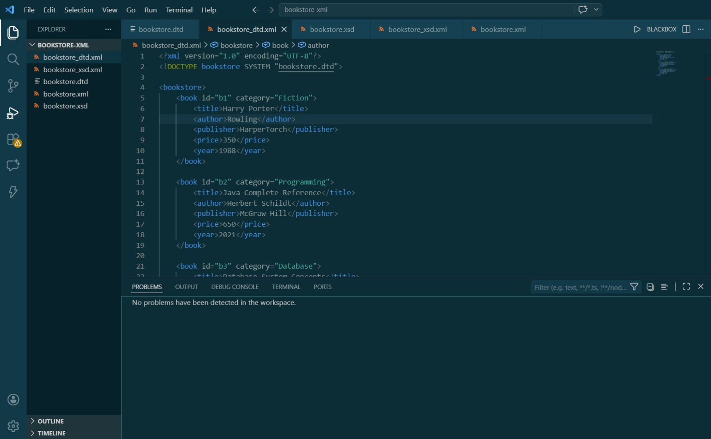
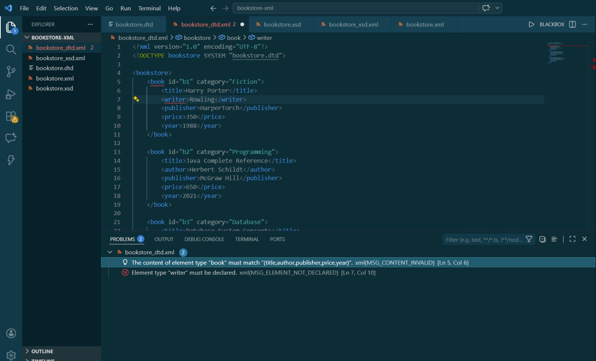
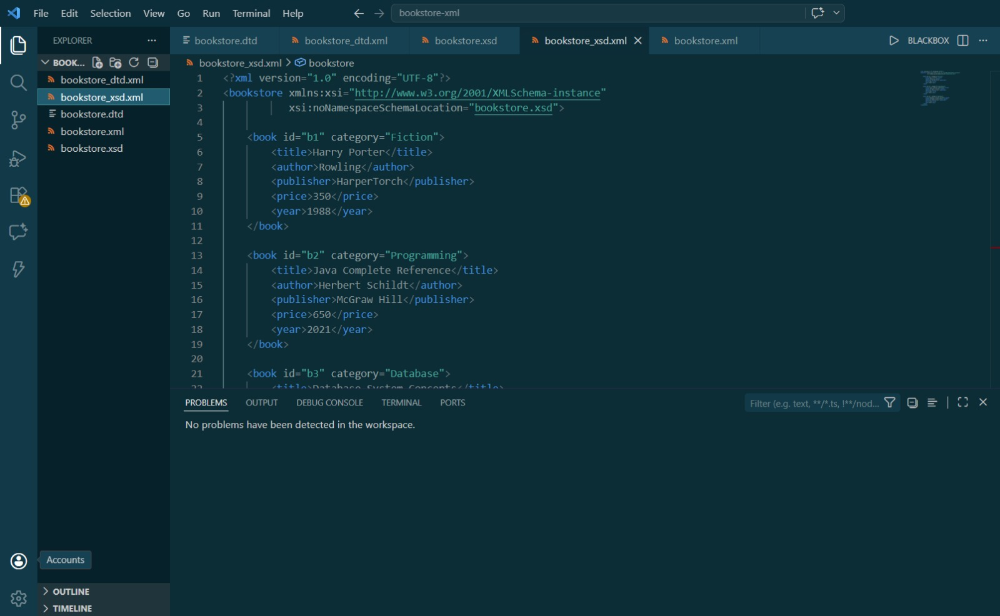
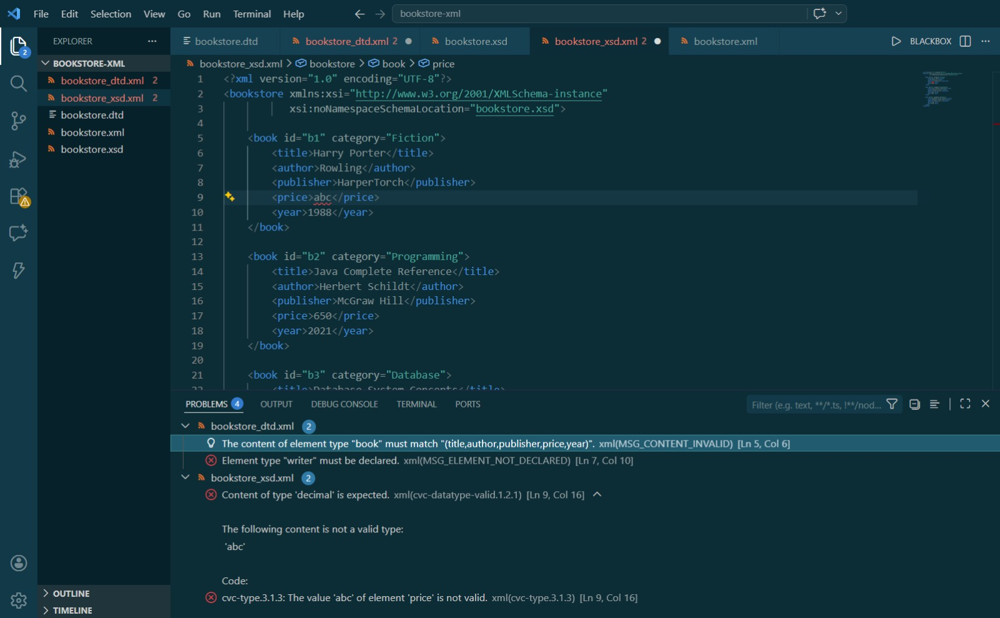
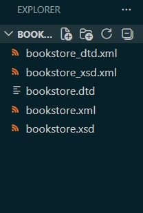

# Bookstore XML Validation using DTD and XSD

This project demonstrates how to create a bookstore XML file and validate it using both DTD and XSD.

## Files

- bookstore.xml - basic XML file with book data  
- bookstore.dtd - defines structure rules  
- bookstore_dtd.xml - XML validated using DTD  
- bookstore.xsd - defines structure and data types  
- bookstore_xsd.xml - XML validated using XSD  
- screenshots/ - contains output screenshots  

## What I did

- Created an XML file with book details  
- Used DTD to validate the structure  
- Used XSD to validate structure and data types  
- Tested validation by introducing errors and fixing them  

## Validation

- DTD checks structure and order of elements  
- XSD checks structure and data types  

## Output

Screenshots include:
- valid DTD output  
- invalid DTD output  
- valid XSD output  
- invalid XSD output  
- folder structure  
## Output

### Valid DTD

### Invalid DTD

### Valid XSD

### Invalid XSD

### Folder Structure

## Conclusion

DTD is used for structure validation, while XSD is more powerful as it validates both structure and data types.